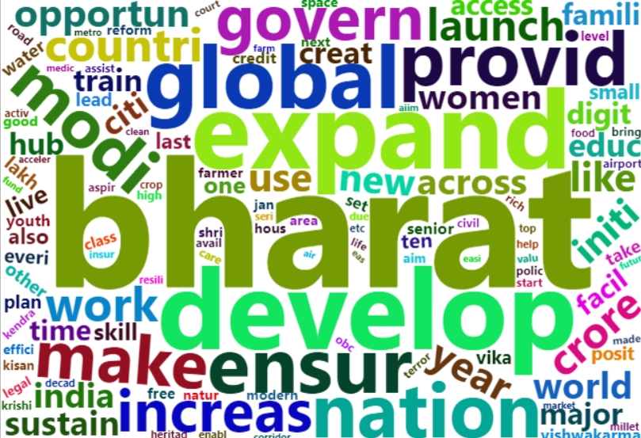
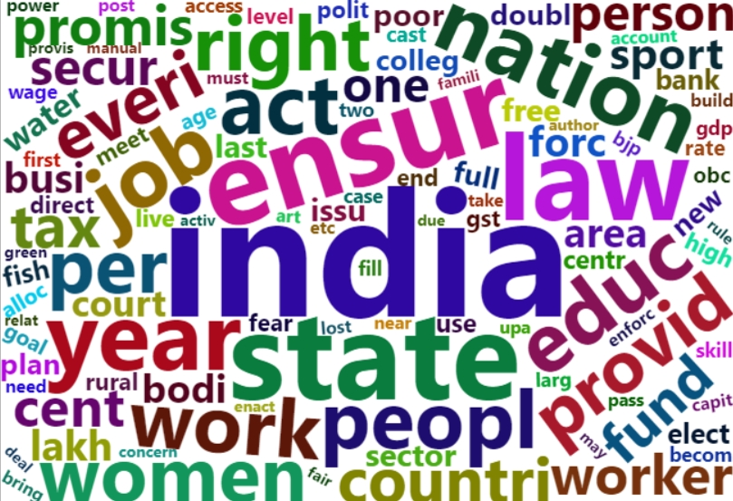

# Political Party Manifesto Word Cloud Analysis: BJP vs Congress 2024

## Description

This repository contains R code for analyzing and visualizing word clouds generated from the manifestos of two prominent Indian political parties, Bharatiya Janata Party (BJP) and Indian National Congress (Congress), during the 2024 Lok Sabha elections.

### Analysis Overview

The analysis utilizes R programming language and several R packages, including `tm`, `pdftools`, `SnowballC`, `wordcloud2`, and `RColorBrewer`. These packages are instrumental in processing the text data extracted from PDF documents, cleaning the text, creating a document-term matrix, and generating word clouds.

### Key Observations

- **BJP Manifesto Highlights:**
  - Emphasis on the term "BHARAT" instead of "INDIA" suggesting a focus on national identity.
  - Key themes include development, expansion, global opportunities and education
  - Certain topics such as healthcare, infrastructure, youth, and agriculture appear less prominently.

- **Congress Manifesto Highlights:**
  - Use of "INDIA" as the central theme indicating a focus on the nation as a whole.
  - Prioritization of education, employment, worker rights, women's issues, and social welfare.
  - Less emphasis on development and sustainability.

### Project Structure

- **R Script**: The main R script (`wordcloud.R`) extracts text from PDF documents, cleans and preprocesses the text data, generates word clouds, and visualizes the results.
  
- **Data**: This folder contains the PDF files of the BJP and Congress manifestos used for analysis.

#### BJP Manifesto Word Cloud

#### Congress Manifesto Word Cloud

